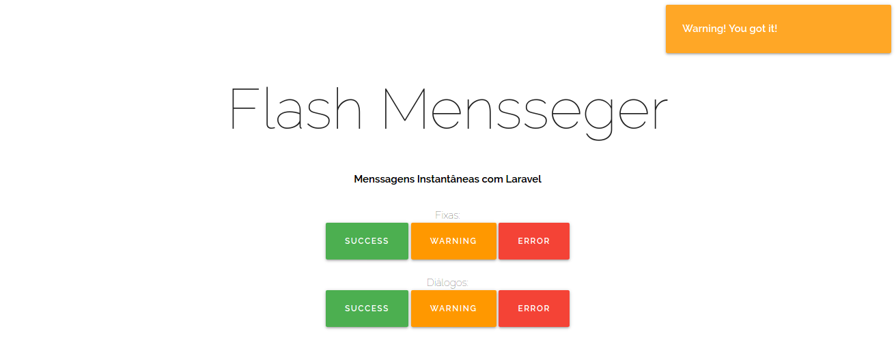

# Flash Messanger
Criando Flash Messages com Laravel e framework front-end  Materialize 1.0 de forma simples. 

São dois os tipos de mensagens: 
- Fixas: Como o próprio nome já diz, ficam fixas no canto superior direito
- Diálogos: Como o mesmo estilo da fixa, porém somem após alguns segundos 

## Instalando: 

1. Clona o projeto: 
```bash
git clone https://github.com/deyvisound/flash_messanger.git
```
2. Baixa as dependências: 
```bash 
php composer install 
```
3. Inicia servidor: 
```bash 
 php artisan serve
```
*Voilà!*

http://localhost:8000/


